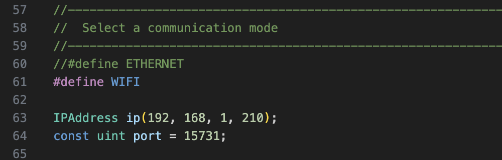

# ESP32_rocrail_can_tcp_gateway
 Order Marklin MS2 (MFX, MM2, DCC) directly from Rocrail, iTrain, JMRI... with TCP (WiFi, Ethernet)

 Pour une présentation complète du projet : https://www.locoduino.org/spip.php?article361

  For a full presentation of the project : https://www.locoduino.org/spip.php?article361

Ethernet or WiFi option :

